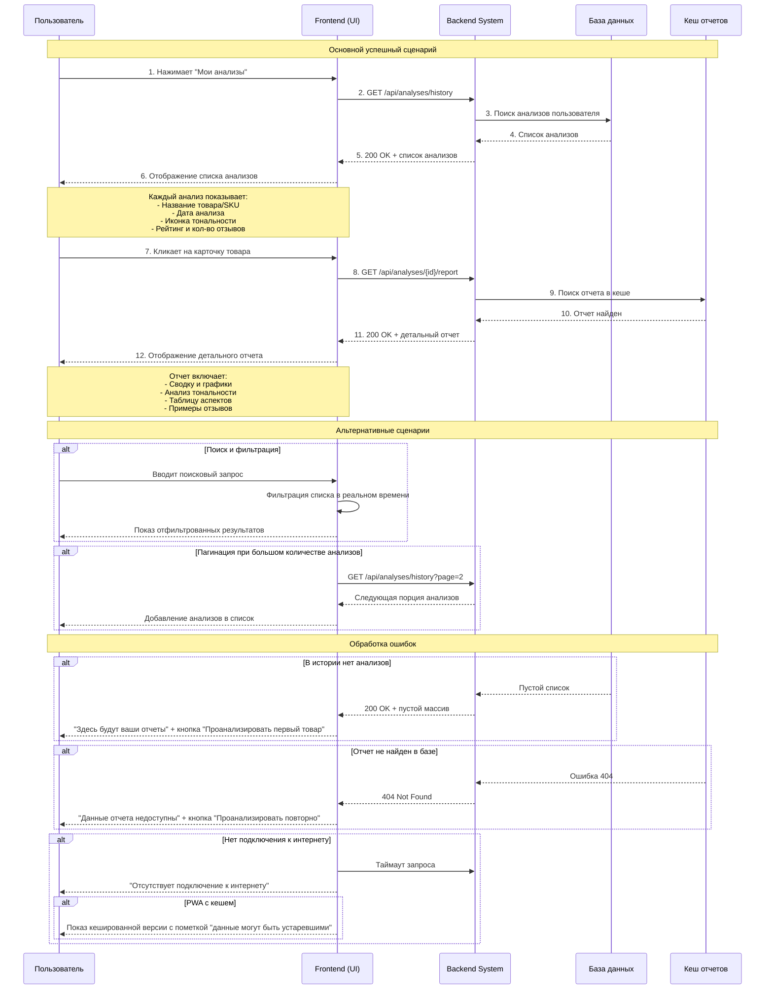

**Автор:** AlexandraR    
**Дата:** 19.09.2025    
**Версия:** 1.0

## 1. Краткое описание
Пользователь (продавец или аналитик) заходит в свой личный кабинет в системе, чтобы просмотреть историю проведенных анализов товаров. Система отображает список всех ранее проанализированных товаров с краткой сводкой по каждому. Пользователь выбирает нужный товар из списка, чтобы просмотреть детальный, ранее сгенерированный отчет, включающий графики, анализ тональности и аспектов.

## 2. Участники (Actors)
- **Пользователь:** Зарегистрированный продавец или аналитик, который ранее проводил анализ товаров через систему.

## 3. Pre-conditions
- Пользователь авторизован в системе.
- У пользователя есть стабильное интернет-соединение.
- В истории пользователя есть как минимум один проведенный анализ.
- Система базы данных и backend работают и доступны.

## 4. Post-conditions
- **Успех:** Пользователь получает доступ к списку своих анализов и может просмотреть детальный отчет по любому из них.
- **Неудача:** Пользователь получает информативное сообщение о причине отсутствия доступа к данным.

## 5. Детальные сценарии

### 5.1. Happy Path (Основной успешный сценарий)

| Шаг | Действие Пользователя | Ответ Системы |
|-----|----------------------|---------------|
| 1 | Пользователь в личном кабинете нажимает на вкладку или кнопку "Мои анализы" / "История отчетов". | Система отправляет запрос к базе данных на получение списка анализов, связанных с аккаунтом пользователя. |
| 2 | ... | Backend система находит и возвращает список анализов. |
| 3 | ... | Frontend отображает список товаров. Для каждого товара показывается:   - **Название товара** (или первые цифры SKU/артикула)   - **Дата и время анализа**   - **Иконка общей тональности** (😊/😐😠)   - **Краткая сводка:** Общий рейтинг и кол-во отзывов. |
| 4 | Пользователь просматривает список и нажимает на карточку товара, отчет по которому он хочет посмотреть. | Система выделяет выбранную карточку. |
| 5 | ... | Система отправляет запрос на получение детального отчета по выбранному ID анализа. |
| 6 | ... | Backend находит готовый отчет в кеше или базе данных и возвращает его frontend. |
| 7 | ... | Система открывает страницу с детальным отчетом, идентичным тому, что пользователь видел после завершения анализа. |
| 8 | Пользователь изучает сохраненный отчет. | Отчет включает всю предыдущую информацию: сводку, графики, таблицу аспектов и примеры отзывов. |

**Ценность для пользователя:**
- **Исторический анализ:** Возможность отслеживать динамику изменения мнения о товаре over time, сравнивая отчеты за разные даты.
- **Быстрый доступ:** Экономия времени и вычислительных ресурсов системы, так как нет необходимости запускать анализ повторно для просмотра результатов.
- **Централизация данных:** Все отчеты собраны в одном месте, что удобно для аудита и презентации результатов.

### 5.2. Alternative Flows (Альтернативные сценарии)

#### A.1: Пользователь использует поиск и фильтры
| Шаг | Действие Пользователя | Ответ Системы |
|-----|----------------------|---------------|
| 1 | В интерфейсе списка анализов пользователь вводит название товара или артикул в поле "Поиск". | Система в реальном времени фильтрует список, показывая только те анализы, которые соответствуют запросу. |
| 2 | Пользователь использует фильтр "Сортировка по дате" или "Сортировка по рейтингу". | Система немедленно перестраивает список в соответствии с выбранным критерием. |
| 3 | Пользователь находит нужный товар через поиск и переходит к отчету. | Дальнейшие шаги совпадают с шагами 4-8 Happy Path. |

**Ценность для пользователя:**
- **Эффективность:** Позволяет мгновенно найти анализ среди большого количества товаров, что критически важно для активных продавцов.
- **Гибкость:** Возможность отсортировать товары по рейтингу помогает быстро выявить проблемные позиции.

#### A.2: В истории много анализов (>50)
| Шаг | Действие Пользователя | Ответ Системы |
|-----|----------------------|---------------|
| 1 | Пользователь открывает "Мои анализы". | Система загружает и отображает первые 10-20 анализов (пагинация или бесконечный скролл). |
| 2 | Пользователь прокручивает список вниз или нажимает "Загрузить еще". | Система подгружает следующую "порцию" анализов, не перезагружая страницу. |
| 3 | Пользователь находит нужный товар и открывает его. | |

**Ценность для пользователя:**
- **Производительность:** Интерфейс не "подвисает" при загрузке большого объема данных, обеспечивая плавность работы.
- **Удобство:** Постепенная загрузка не перегружает пользователя информацией и позволяет быстрее начать работу.

### 5.3. Error Handling (Обработка ошибок)

#### E.1: В истории нет ни одного анализа
| Шаг | Действие Пользователя | Ответ Системы |
|-----|----------------------|---------------|
| 1 | Пользователь впервые заходит в систему и переходит в раздел "Мои анализы". | Backend возвращает пустой массив анализов. |
| 2 | ... | Frontend вместо пустого списка показывает стилизованный экран с сообщением: "Здесь будут ваши отчеты" и кнопкой "Проанализировать первый товар", которая ведет на главную страницу. |

**Ценность для пользователя:**
- **Вовлечение:** Интуитивно понятный guidance, что делать дальше, вместо разочарования от пустой страницы.
- **Онбординг:** Сообщение мягко подталкивает пользователя к совершению первого целевого действия.

#### E.2: Детальный отчет не найден (был удален из кеша)
| Шаг | Действие Пользователя | Ответ Системы |
|-----|----------------------|---------------|
| 1 | Пользователь нажимает на анализ в истории. | Backend не находит детальные данные отчета в базе (например, истекло время хранения). |
| 2 | ... | Backend возвращает ошибку `404 Not Found`. |
| 3 | ... | Frontend показывает сообщение: "Данные отчета временно недоступны. Необходимо провести анализ заново." Предлагает кнопку "Проанализировать повторно", которая pre-fills форму ссылкой на этот товар. |

**Ценность для пользователя:**
- **Восстановление контекста:** Пользователю не приходится вручную искать ссылку на товар для повторного анализа, система делает это за него.
- **Ясность:** Четкое объяснение причины проблемы и простое решение.

#### E.3: Нет доступа к сети при загрузке списка
| Шаг | Действие Пользователя | Ответ Системы |
|-----|----------------------|---------------|
| 1 | Пользователь пытается открыть раздел "Мои анализы" при обрыве соединения. | Frontend пытается отправить API-запрос, который завершается с ошибкой сети. |
| 2 | ... | Система показывает toast-уведомление или сообщение прямо в интерфейсе: "Отсутствует подключение к интернету. Список анализов не может быть загружен." |
| 3 | ... | Если приложение является PWA, оно может показывать кэшированную версию последнего загруженного списка с пометкой "данные могут быть устаревшими". |

**Ценность для пользователя:**
- **Работоспособность:** Пользователь может просматривать кэшированные отчеты в оффлайне, что критично для мобильных сценариев.
- **Информированность:** Пользователь сразу понимает, что проблема связана с его соединением, а не с работой сайта.

## 6. Use-case UML Диаграмма

# Use Case: Просмотр истории анализов - Sequence Diagram

## Диаграмма последовательности

## Описание процесса

### Основной сценарий:
1. **Пользователь** заходит в раздел "Мои анализы"
2. **Система** загружает историю проведенных анализов
3. **Пользователь** выбирает конкретный отчет для просмотра
4. **Система** отображает детальный отчет со всей аналитикой

### Элементы отображения:
- **Список анализов**: название товара, дата анализа, иконка тональности, рейтинг
- **Детальный отчет**: сводка, графики, анализ тональности, таблица аспектов, примеры отзывов

### Особенности:
- Поддержка поиска и фильтрации в реальном времени
- Пагинация для большого количества анализов
- Обработка различных ошибок (нет анализов, отчет не найден, нет сети)
- Оффлайн-режим для PWA приложений

