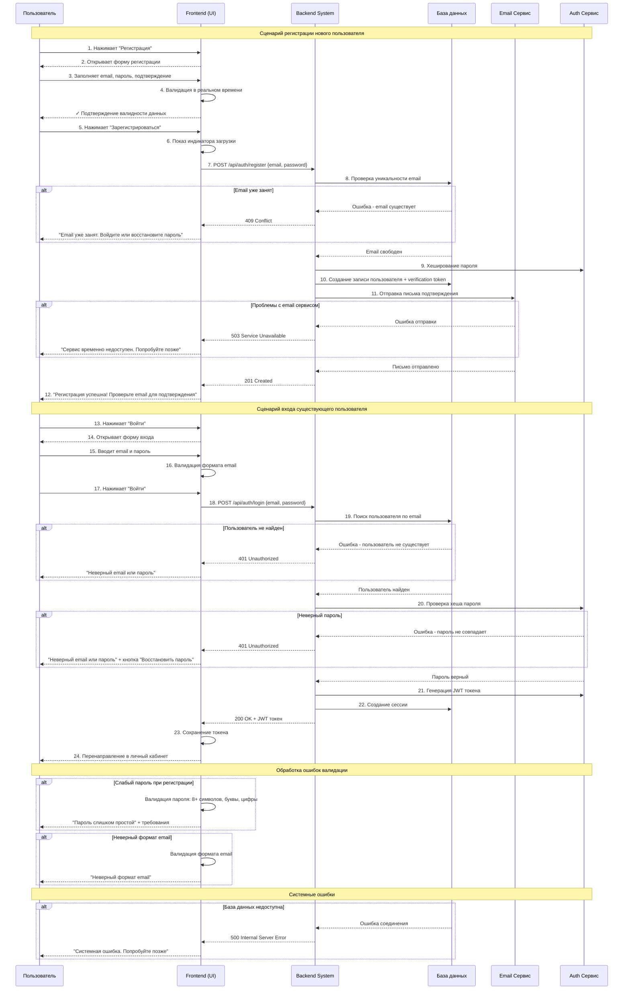

# Use-case Narrative: Регистрация и вход в систему

**Автор:** AlexandraR    
**Дата:** 19.09.2025    
**Версия:** 1.0

## 1. Краткое описание
Новый пользователь (продавец или аналитик) создает учетную запись в системе анализа отзывов через процесс регистрации. Существующий пользователь входит в систему с помощью email и пароля. Система обеспечивает безопасную аутентификацию, подтверждение email и восстановление доступа при необходимости.

## 2. Участники (Actors)
- **Новый пользователь:** Продавец или аналитик, который впервые использует систему.
- **Существующий пользователь:** Зарегистрированный пользователь, имеющий учетную запись в системе.

## 3. Pre-conditions
- Пользователь имеет доступ к интернету.
- Пользователь имеет действующий email адрес.
- Система аутентификации и база данных пользователей работают и доступны.

## 4. Post-conditions
- **Успех регистрации:** Создана новая учетная запись, пользователь подтвердил email и вошел в систему.
- **Успех входа:** Пользователь аутентифицирован и получил доступ к личному кабинету.
- **Неудача:** Пользователь получает информативное сообщение об ошибке с рекомендациями по исправлению.

## 5. Детальные сценарии

### 5.1. Happy Path (Основной успешный сценарий)

#### Регистрация нового пользователя
| Шаг | Действие Пользователя | Ответ Системы |
|-----|----------------------|---------------|
| 1 | Пользователь нажимает кнопку "Регистрация" на главной странице. | Система открывает форму регистрации с полями: email, пароль, подтверждение пароля. |
| 2 | Пользователь заполняет все обязательные поля валидными данными. | Система validates данные в реальном времени (формат email, сложность пароля, совпадение паролей). |
| 3 | Пользователь нажимает кнопку "Зарегистрироваться". | Система отображает индикатор загрузки. |
| 4 | ... | Backend проверяет уникальность email в базе данных. |
| 5 | ... | Система создает запись пользователя в базе (с хешированием пароля) и генерирует verification token. |
| 6 | ... | Система перенаправляет пользователя в личный кабинет с приветственным сообщением. |

#### Вход существующего пользователя
| Шаг | Действие Пользователя | Ответ Системы |
|-----|----------------------|---------------|
| 1 | Пользователь нажимает кнопку "Войти" на главной странице. | Система открывает форму входа с полями: email и пароль. |
| 2 | Пользователь вводит email и пароль. | Система validates формат email. |
| 3 | Пользователь нажимает кнопку "Войти". | Система отображает индикатор загрузки. |
| 4 | ... | Backend проверяет существование пользователя и сверяет хеш пароля. |
| 5 | ... | Система создает JWT token и сессию. |
| 6 | ... | Система перенаправляет пользователя в личный кабинет. |

**Ценность для пользователя:**
- **Быстрый старт:** Минимальный набор полей для регистрации позволяет начать работу с системой за несколько минут.
- **Безопасность:** Хеширование паролей и email подтверждение обеспечивают защиту учетной записи.
- **Удобство:** Автоматический вход после подтверждения email исключает лишние шаги.

### 5.3. Error Handling (Обработка ошибок)

#### E.1: Неверные учетные данные при входе
| Шаг | Действие Пользователя | Ответ Системы |
|-----|----------------------|---------------|
| 1 | Пользователь вводит неверный email или пароль. | Backend возвращает ошибку аутентификации. |
| 2 | ... | Frontend показывает сообщение: "Неверный email или пароль. Проверьте правильность ввода." |
| 3 | ... | Система предлагает кнопку "Восстановить пароль". |

**Ценность для пользователя:**
- **Безопасность:** Система не уточняет, что именно неверно (email или пароль), чтобы избежать подбора.
- **Быстрое восстановление:** Сразу доступен вариант решения проблемы.

#### E.2: Email уже занят при регистрации
| Шаг | Действие Пользователя | Ответ Системы |
|-----|----------------------|---------------|
| 1 | Пользователь пытается зарегистрироваться с email, который уже есть в системе. | Backend проверяет уникальность и возвращает ошибку. |
| 2 | ... | Frontend показывает сообщение: "Пользователь с таким email уже зарегистрирован. Войдите или восстановите пароль." |
| 3 | ... | Система предлагает кнопки "Войти" и "Восстановить пароль". |

**Ценность для пользователя:**
- **Направление к решению:** Четкие инструкции что делать в данной ситуации.
- **Экономия времени:** Пользователь сразу переходит к решению проблемы.

#### E.3: Слабый пароль при регистрации
| Шаг | Действие Пользователя | Ответ Системы |
|-----|----------------------|---------------|
| 1 | Пользователь вводит слишком простой пароль. | Валидация на frontend показывает требования: "Пароль должен содержать 8+ символов, буквы и цифры." |
| 2 | Пользователь нажимает "Зарегистрироваться" с weak password. | Система блокирует отправку формы и подсвечивает поле с ошибкой. |
| 3 | ... | Сообщение: "Пароль слишком простой. Используйте буквы в разных регистрах, цифры и специальные символы." |

**Ценность для пользователя:**
- **Безопасность аккаунта:** Защита от взлома простых паролей.
- **Обучение:** Пользователь узнает о лучших практиках безопасности.

## 6. Use-case UML Диаграмма

# Use Case: Регистрация и вход в систему - Sequence Diagram

## Диаграмма последовательности

## Описание процесса

### Сценарий регистрации:
1. **Пользователь** заполняет форму регистрации
2. **Система** проверяет уникальность email и сложность пароля
3. **Создается** учетная запись с хешированием пароля
4. **Отправляется** письмо подтверждения на email
5. **Пользователь** получает уведомление об успешной регистрации

### Сценарий входа:
1. **Пользователь** вводит email и пароль
2. **Система** проверяет существование пользователя и сверяет пароль
3. **Генерируется** JWT токен для сессии
4. **Пользователь** перенаправляется в личный кабинет

### Обработка ошибок:
- **Неверные учетные данные** - защита от подбора
- **Занятый email** - предложение войти или восстановить пароль
- **Слабый пароль** - требования к сложности
- **Системные ошибки** - проблемы с БД или email сервисом

### Особенности безопасности:
- Хеширование паролей
- JWT токены для сессий
- Email подтверждение
- Защита от brute-force атак

 
   
